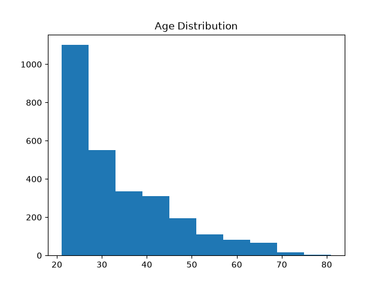
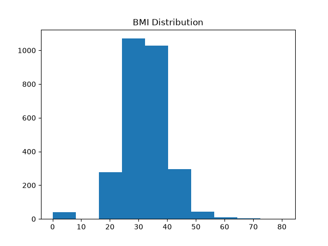

# Healthcare Diabetes Analysis Project

## Student

ADAVALA JAHNAVI

## Problem Statement

Diabetes is one of the most common health conditions worldwide. This project analyzes healthcare data to identify important factors related to diabetes and prepare the dataset for machine learning.

## Dataset Source

Dataset Name:
Healthcare Diabetes Dataset

Source:
https://www.kaggle.com/datasets/nanditapore/healthcare-diabetes

## Approach

1. Downloaded healthcare dataset
2. Performed exploratory data analysis (EDA)
3. Checked shape, columns and data types
4. Identified missing values
5. Created visualizations
6. Cleaned dataset
7. Removed duplicates
8. Performed feature engineering
9. Scaled numerical features
10. Split data into training and testing sets

## Technologies Used

* Python
* Pandas
* Matplotlib
* Scikit-Learn
* Git
* GitHub

## Project Structure

data/
docs/
src/
README.md

## Results

The dataset contains 2768 patient records and 10 healthcare-related attributes. Data preprocessing and feature engineering were completed successfully.

## Visualizations

### Age Distribution

### BMI Distribution

